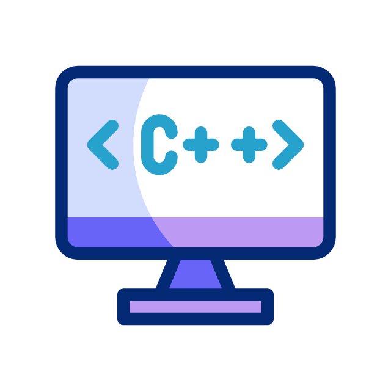
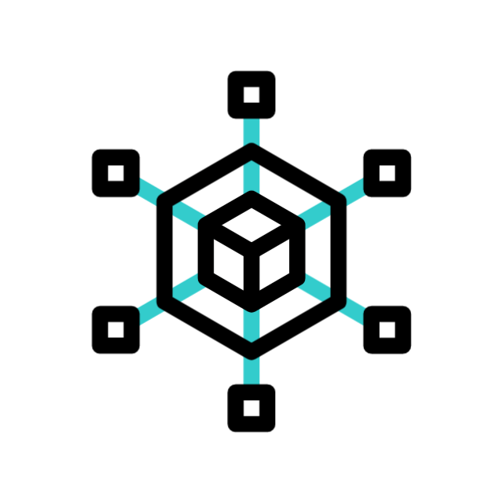
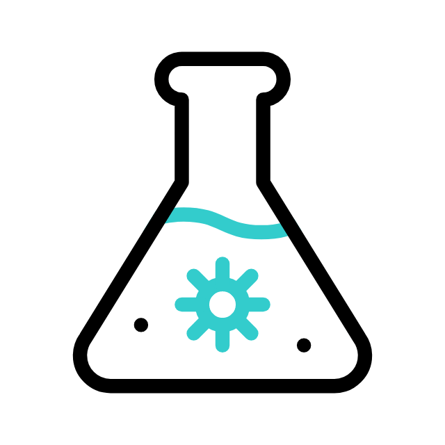

<h1 align="center">Welcome Folks 👋</h1>

  <i>"Recently I was thinking — why can't humans fly? 🤔 
  Anyways, while I figure that out... check out my projects and skills!"</i>

 

<!-- Top row: 6 GIFs -->

  
  
  
  
  
  

<!-- Bottom row: 4 GIFs -->

  
  
  
  

  <table>
    <tr>
      <td>
        
      </td>
      <td>
        
      </td>
    </tr>
  </table>

 

  

---

  

<!-- Proudly created with GPRM ( https://gprm.itsvg.in ) -->

<!-- Proudly created with GPRM ( https://gprm.itsvg.in ) -->
