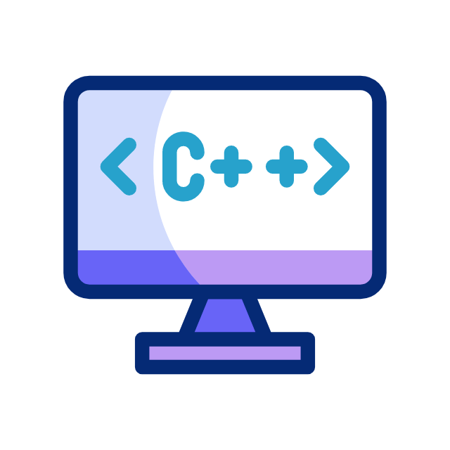

<h1 align="center">Welcome Folks 👋</h1>

  <i>"Recently I was thinking — why can't humans fly? 🤔 
  Anyways, while I figure that out... check out my projects and skills!"</i>

 

<!-- Top row: 6 GIFs -->

  
  
  
  
  
  

<!-- Bottom row: 4 GIFs -->

  
  
  
  

